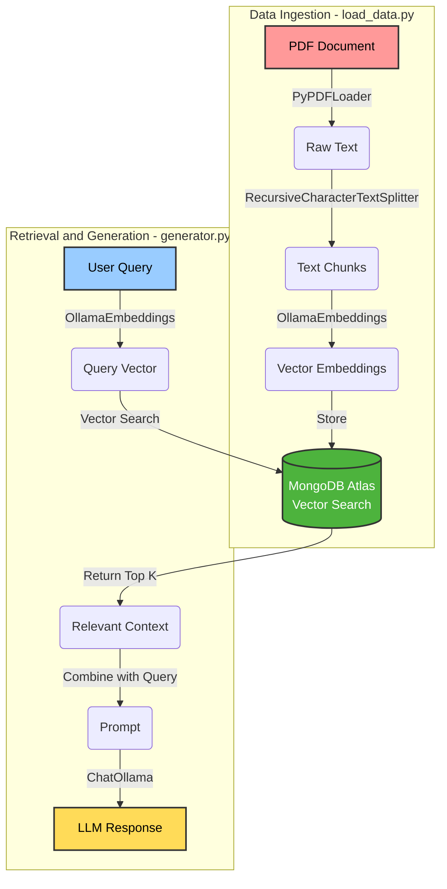

# atlast-vector-search

A local Retrieval-Augmented Generation (RAG) system leveraging **MongoDB Atlas Vector Search** for storage and retrieval, and **Ollama** for local LLM inference. This project demonstrates how to ingest PDF documents, chunk them, create embeddings, and query them using natural language.

## Architecture

The system consists of two main workflows: **Data Ingestion** and **Query/Generation**.



## Prerequisites

*   **Python 3.8+**
*   **MongoDB Atlas Account**: You need a cluster with Vector Search enabled.
*   **Ollama**: Installed locally/networked.
    *   Language Model: `llama3.2:1b` (configurable)
    *   Embedding Model: `bge-base-en-v1.5-gguf` (configurable)

## Setup

1.  **Clone the Repository**
    ```bash
    git clone <this repository url>
    cd atlast-vector-search
    ```

2.  **Create a Virtual Environment**
    ```bash
    python -m venv venv
    source venv/bin/activate 
    ```

3.  **Install Dependencies**
    ```bash
    pip install -r requirements.txt
    ```

4.  **Configure Environment Variables**
    Create a `.env` file in the root directory:
    ```env
    MONGODB_URI="your_mongodb_uri"
    OLLAMA_BASE_URL=http://localhost:11434
    LANGUAGE_MODEL=hf.co/bartowski/Llama-3.2-1B-Instruct-GGUF
    EMBEDDING_MODEL=hf.co/CompendiumLabs/bge-base-en-v1.5-gguf
    ```

## Usage

### 1. Data Ingestion
Run `load_data.py` to parse the PDF (default: `./sample/mongodb.pdf`), generate embeddings, and store them in MongoDB.

```bash
python load_data.py
```

### 2. Querying
Run `generator.py` to ask questions about the ingested data.

```bash
python generator.py
```
*Modify the `print(query_data("..."))` line in `generator.py` to change the question.*

## Key Learnings

This project highlights several core concepts in building AI applications:

*   **RAG (Retrieval-Augmented Generation)**: How to combine external data (PDFs) with LLMs to reduce hallucinations and answer specific questions.
*   **Vector Search**: Understanding how text is converted into high-dimensional vectors (embeddings) and how databases like MongoDB perform similarity searches to find relevant context.
*   **Local Inference**: Using Ollama to run powerful open-source models (like Llama 3) locally, avoiding API costs and ensuring data privacy.

### Learning Resources
*   [MongoDB Atlas Vector Search](https://learn.mongodb.com/learn/course/rag-with-mongodb/rag-with-mongodb/create-a-rag-application?client=customer&page=1)
*   [LLama 3.2](https://huggingface.co/bartowski/Llama-3.2-1B-Instruct-GGUF)
*   [Voyage AI](https://docs.voyageai.com/docs/introduction)

